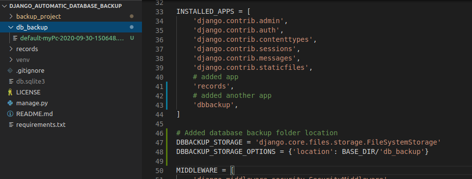
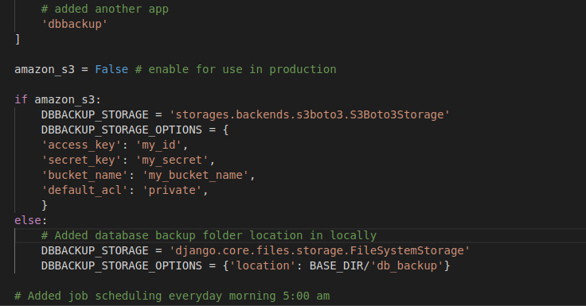
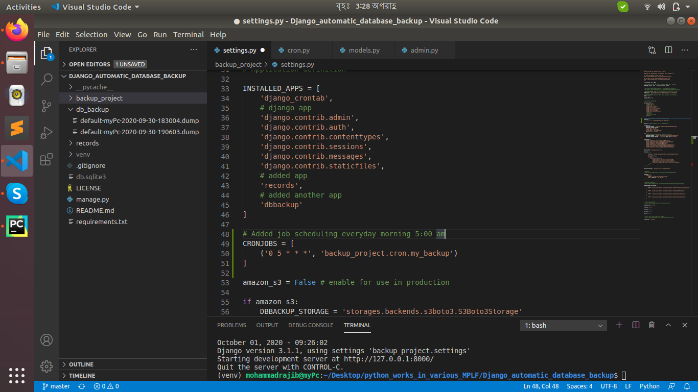
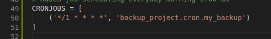
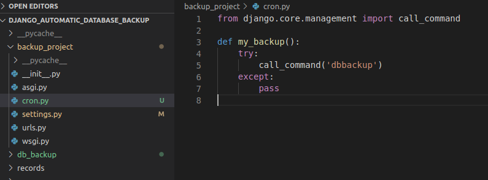

# অটোমেটিক ডাটাবেস ব্যাকআপ

প্রথমে আমাদের ভার্চুয়াল এনভায়রনমেন্ট এর ভিতর ডাটাবেস ব্যাকআপ এর জন্য একটি প্যাকেজ ইনস্টল করতে হবে।

```text
pip install django-dbbackup
```

এরপর আমাদের প্রজেক্টের সেটিং ফাইলে এপপ্সটি অ্যাড করতে হবে। এবং ডাটাবেস ব্যাকআপ লোকেশন সেট করতে হবে।



ম্যানুয়ালি ডাটাবেস ব্যাকআপ এর জন্য:

```text
python manage.py dbbackup
```

 ডাটাবেস পুনরুদ্ধার করতে:

```text
python manage.py dbrestore
```

এবং আমরা যদি Amazon s3 তে ব্যাকআপ ফাইল গুলো রাখতে চাই, তার জন্য আমাদের একটি প্যাকেজ ইনস্টল করতে হবে।

```text
pip install django-storages[boto3]
```

এরপর আমাদের প্রজেক্টের সেটিং ফাইলে Amazon s3 এর জন্য কনফিগার করতে হবে।



## **এখন আমরা দেখবো কিভাবে ডাটাবেস অটোমেটিক ব্যাকআপ করা যায়। তার জন্য আমাদের একটি প্যাকেজ ইনস্টল করতে হবে :**

```text
pip install django-crontab
```

এরপর আমাদের প্রজেক্টের সেটিং ফাইলে এপপ্সটি অ্যাড করতে হবে। এবং cronjob scheduling অ্যাড করতে হবে। এবং সেখানে বলে দিবো প্রতিদিন সকাল ৫ টা বাজে একবার ডাটাবেস ব্যাকআপ হবে।



ডাটাবেস অটো ব্যাকআপ হচ্ছে তা চেক করে দেখতে, প্রতি মিনিট করে দেখি :



এরপর আমরা প্রজেক্ট ফোল্ডারে cron.py নামে একটি ফাইল তৈরী করবো এবং সেই ফাইলে একটি function লিখবো :



এরপর আমরা এই অটোমেটিক প্রসেসে অ্যাড করবো।

```text
python manage.py crontab add
```

আমাদের বর্তমান একটিভ প্রসেসগুলো দেখতে :

```text
python manage.py crontab show
```

আমরা চাইলে অটোমেটিক প্রসেস গুলো রিমুভ করতে পারি :

```text
python manage.py crontab remove
```


রেফারেন্স :

* [x] django-dbbackup &gt; [https://django-dbbackup.readthedocs.io/en/master/installation.html](https://django-dbbackup.readthedocs.io/en/master/installation.html)
* [x] django-crontab &gt; [https://pypi.org/project/django-crontab/](https://pypi.org/project/django-crontab/)
* [x] django-storages\[boto3\] &gt; [https://django-dbbackup.readthedocs.io/en/master/storage.html](https://django-dbbackup.readthedocs.io/en/master/storage.html)

**উদাহরণস্বরূপ** &gt;&gt; [https://github.com/github-rajib/Django\_automatic\_database\_backup](https://github.com/github-rajib/Django_automatic_database_backup)


## ধন্যবাদ 🙂 

